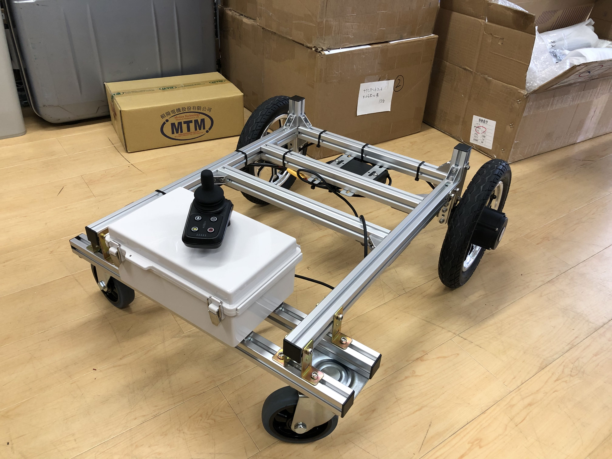
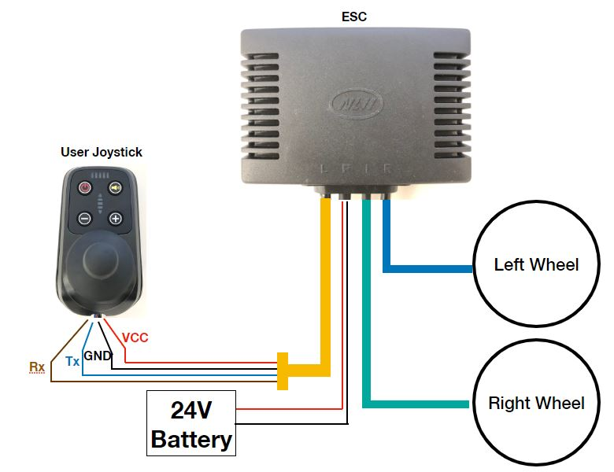
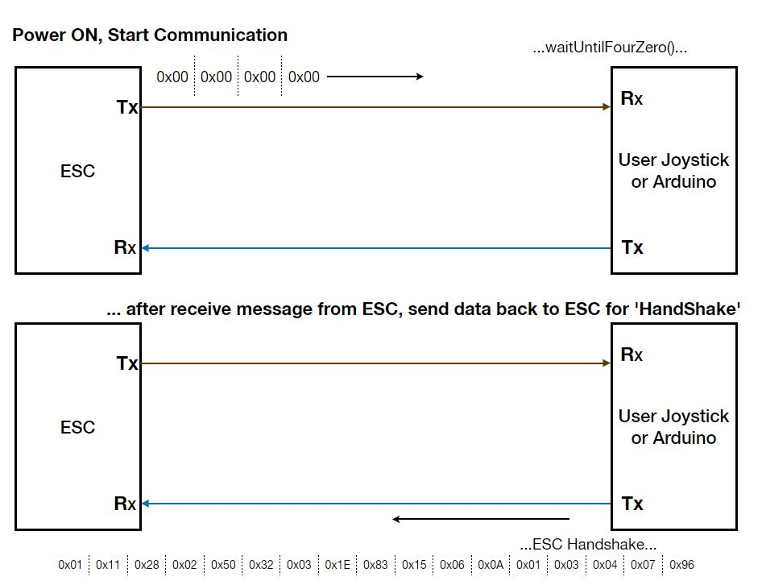
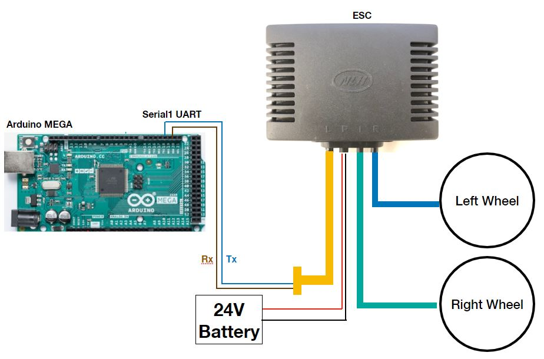

# BrushlessDriveWheels

This project is to hack a brushless drive wheels unit. The wheels, ESC and controller are sold in the set for wheelchair-like UGV, so user can control the speed and direction of the vehicle by using the controller or joystick that comes with. The supplier from China doesn't provide a detail to modify the controller, but in our application, we focus on an unmanned ground vehicle with autonomuos drive, so our goal for this project is to hack the communication between the ESC and the joystick, then pass our own command from other input (e.g. Arduino, Pi, or RC transmitter).

The tested UGV is look like this image below




Normally, a general wiring of this unit is as shown here...



# Hack #
We need to supply 24V battery (or 6cell LiPo) to the ESC and plug all of the components together (Left wheel, right wheel and the joystick). There are four wires connecting to the joystick, from investigation, those are supply voltage 24V and ground pin and two communication wires Tx and Rx. After checking the voltage of each line and make sure it's safe enough, I used a Logic Anaylzer probe to check what kind of data are they communicating. 

After looking it for a while, I can summarize it on this figure...



First, when the power is ON, the ESC will send four bytes of zero to the joystick, so the joystick needs to receive this message then send back 17bytes of initialization parameters packet for 20times, kind of "Hand Shake" between devices. I was mimicking this behavior by waiting the incoming byte as `waitUntilFourZero()`, then send those 17bytes back to the ESC by using `ESCHandShake()`. In the code BrushlessWheels.cpp, you can see how it works on Init() function.
```
void BrushlessWheels::Init()
{
  waitUntilFourZero();                                  // Wait ESC to response and do a hand-shake
  delay(219);                                           // DON'T change this delay, it's from hacking
  ESCHandShake();

  for (i=1;i<10;i++)                                    // start the wheels from zero rpm before drive
  {
    zeroSpeed();
  }
}
```
After doing the HandShake, the ESC are ready and keep waiting for the speed command. So in the code, I set the speed of those wheel as zero for a short time in for loop of `zeroSpeed()`. After this process, we can send the speed command byte as this following packet


The first two bytes are Headers, then two bytes of speed of first wheel and two bytes of speed of second wheel. Next are two bytes of MODE, but after trial and error, I found out that this is "don't care", so we can simpply set it as 0x00 for both. Last byte is a check sum of all bytes.

So instead of using their joystick, I changed to Arduino MEGA or Nano and the wiring are as follow




with external MCU, we can send a command packet to the ESC and use it with autonomouos drive or other applications.

# Example #
First, download BrushlessWheels.cpp, BrushlessWheels.h and all the stuff into Arduino libraries folder in your PC. Then open examples/DirectCommand folder (for Arduino Mega) or TwoSerials folder (for Arduino Nano), you can see a simple how to use this API to control these wheels
```
#include <BrushlessWheels.h>
#include <SoftwareSerial.h>

//Software Serial (RX,TX)
SoftwareSerial wheelSerial(11,10);

BrushlessWheels BW(&wheelSerial);

void setup() {
  // for PC uart prinln
  Serial.begin(115200);

  // baudrate of wheel's esc must be 9600
  while(!(BW.serialBegin(9600)));
  // initialize the wheel's esc
  BW.Init();

  Serial.println("Initialized complete!");
}

void loop() {
  
  // Input two RPM values for both wheels
  BW.DriveWheels(60.0,60.0);

}
```
First, choose the SoftwareSerial pins as you want to use, I used 11 as Rx and 10 as Tx, but becareful that those pins are available for your Arduino board. Then just make an object of library, `BrushlessWheels BW(&wheelSerial)` and pass the wheelSerial reference to it. Specify baudrate of the wheel's ESC as 9600 (mandatory), then do an initialization `BW.Init()` then you are ready to send the RPM command to control the speed of those wheels as `BW.DriveWheels(60.0,60.0)`. The maximum speed is 144RPM for both forward and reverse.
If you have an two-axis analog joystick, you can try an example of JoyControlCommand.ino by plugging the analog line to A0 and A1 on your Arduino.


